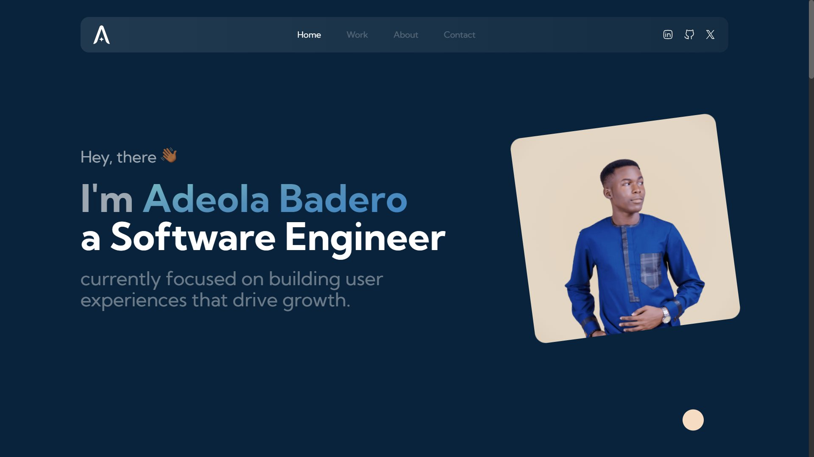
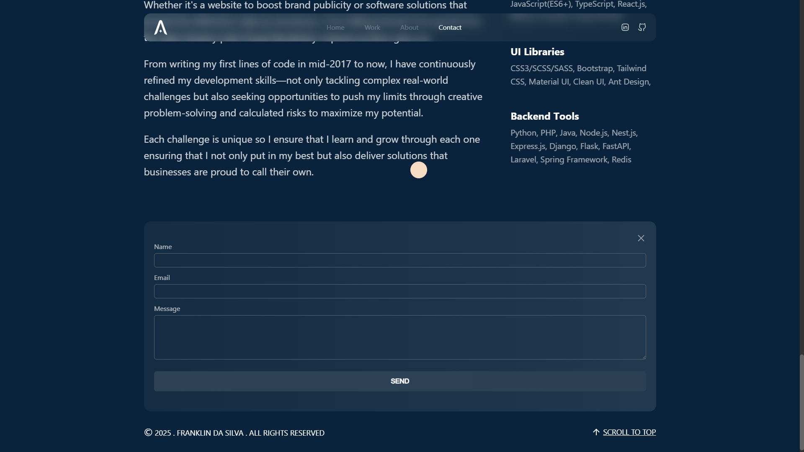

# Portfolio Website — v1

My name is Franklin Da Silva, a Full-Stack Developer with extensive experience in SaaS, FinTech, EduTech and e-Commerce. I enjoy crafting web application that aid business growth and software that makes lives easier; Honing technology, to better ease lives and improve the world I live in.

# Tech Stack

Technologies: React, Next.js, Typescript, Tailwind, React-hook-form, Email.js and Framer Motion <br>

# Gallery





[View Live Demo](https://adeolabadero.netlify.app)

# Get started

Clone the project

```
git clone https://github.com/Franklin-Da-Silva/My-Portfolio.git
```

Go to the project directory

```
cd ade-folio
```

Install dependencies

```
yarn install
```

Start the development server

```
yarn dev
```
